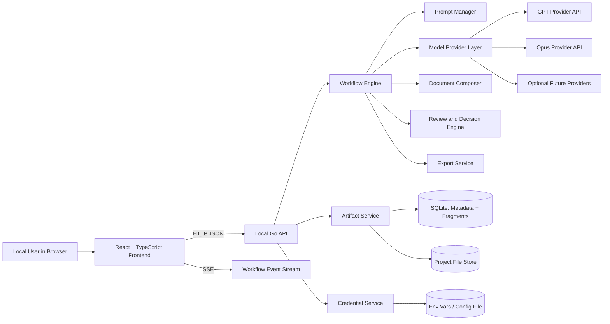

# flywheel-planner Implementation Plan

## Document Control

- **Product Scope:** V1 implementation with correctness, reliability, and operational robustness
- **Date:** 2026-03-22
- **Revision:** V8 — introduces fragment-based document storage, eliminates the edit-application pipeline, removes manual user editing in favour of guidance-driven model iteration

## 1. Objective

Build `flywheel-planner` as a local-first, single-user, document-centric planning workbench that turns rough markdown PRDs into world-class implementation plans through a fixed, inspectable, multi-model workflow. Models interact with the system through structured tool calls rather than free-form text parsing, eliminating the fragility of output-format parsing and making every model contribution a validated, structured submission.

PRDs and implementation plans are stored internally as versioned fragments — addressable sections whose content lives in the database. Markdown is a derived view, composed from fragments on demand for model context, user display, and export. This fragment-based model eliminates the entire class of problems associated with text-matching edit application (`old_text` anchor validation, offset drift, conflict resolution) by making every model change a direct operation on an identified fragment.

This plan translates the PRD into concrete architecture, storage, workflow, UX, delivery sequencing, and quality controls so V1 satisfies every stated requirement while staying disciplined about scope.

## 2. Source Documents Used

- `PRODUCT_REQUIREMENT_DOCUMENTS.md` - primary product requirements source; this repository uses the plural filename.
- `REACT_BEST_PRACTICES.md` - informs frontend architecture, state management, accessibility, testing, and UI implementation standards.
- `GOLANG_BEST_PRACTICES.md` - informs backend architecture, concurrency, error handling, testing, and reliability standards.

## 3. Decisions To Lock Now

These choices close the PRD's open questions and keep implementation deterministic.

| Topic | Decision                                                                                                                                                                                                              | Why |
|---|-----------------------------------------------------------------------------------------------------------------------------------------------------------------------------------------------------------------------|---|
| User editing model | Default to guidance-driven iteration, but permit checkpoint-only manual fragment edits in V1 with explicit provenance tagging and version creation.                                                                   | Preserves the flywheel loop while giving users a practical escape hatch for factual fixes, terminology corrections, and model-resistant edits without introducing general-purpose collaborative editing complexity. |
| Document storage model | PRDs and plans are stored as versioned fragments in SQLite. Markdown is composed from fragments on demand for model context, display, and export.                                                                     | Eliminates the edit-application pipeline (old_text matching, offset drift, conflicts). Fragment operations are atomic and unambiguous — a fragment ID either exists or it doesn't. |
| Best-practice guides | Support both user-supplied and system-provided guides; use built-in guides for known stacks and accept user uploads for custom stacks                                                                                 | Meets flexibility needs without requiring a model call during foundations |
| Foundation strictness | Require non-empty project name, stack, and architecture direction; everything else is strongly encouraged but not hard-blocking                                                                                       | Keeps flow moving while still enforcing foundational clarity |
| Prompt adaptation | Adapt baseline prompt text from the PRD to reference tool-based submission; preserve original PRD prompt text as a reference guide, not a verbatim inclusion requirement                                              | The PRD's baseline prompts were written before tool-based submission was chosen; adapting them to reference tools produces better model behavior than mixing tool definitions with prose instructions to emit git-diffs |
| Export default | Export curated canonical artifacts by default; include raw intermediates via explicit option                                                                                                                          | Keeps exports clean while preserving inspectability |
| Branching | Do not expose branching, but keep the schema branch-ready                                                                                                                                                             | Respects scope while avoiding a dead-end design |
| Iteration count | Support repeated loops, default `4`, with early exit on convergence                                                                                                                                                   | Matches the PRD and avoids unbounded workflow drift; convergence detection prevents wasted iterations |
| Loop convergence | If a review pass results in zero fragment operations, offer to exit the loop early rather than forcing remaining iterations                                                                                           | Avoids wasted API cost and reduces risk of late-loop regressions where the model starts tinkering with already-good prose |
| Review loop model diversity | Default to GPT for review loop iterations, but schedule one Opus review pass at the loop midpoint to reintroduce model diversity                                                                                      | Prevents single-model bias from compounding across iterations; Opus catches different classes of issues than GPT |
| Seed PRD quality gate | Run a lightweight structural assessment of the seed PRD before Stage 3 and surface warnings for obviously incomplete inputs                                                                                           | Prevents expensive multi-model generation from building on a weak foundation |
| Parallel-stage quorum | Require at least one successful GPT-family run and one successful Opus-family run before synthesis; optional-model failures may remain retryable or require explicit override                                         | Preserves the product's core cross-model comparison value |
| Prompt editing | Keep baseline prompts locked; allow advanced users to clone wrapper variants only in advanced settings                                                                                                                | Preserves product contract and auditability |
| Malformed outputs | On tool-call validation failure, follow a bounded recovery ladder: full retry, partial acceptance of independently valid tool calls, then user-guided retry with all raw tool-call attempts preserved                 | Leverages tool-calling validation for targeted feedback; avoids both blind retry and premature abandonment |
| Failed model runs | Require explicit user action to retry or continue with missing outputs after all runs settle                                                                                                                          | Avoids silent omission of models |
| Artifact retention | Treat artifacts and prompt records as append-only; archive projects by default and never perform silent cleanup or deletion in normal workflow                                                                        | Protects lineage and aligns with the project's safety posture |
| Secrets storage | Load provider API keys from environment variables first, then from a permission-protected local config file (`~/.flywheel-planner/credentials.json`, `0600`); the UI may write keys to the config file for convenience | Matches standard CLI credential conventions (AWS CLI, gh, Docker), works identically on macOS and Linux, avoids OS keychain cross-platform complexity |
| Large context handling | Use deterministic section-packaging and capability-aware attachments; never silently truncate source artifacts                                                                                                        | Preserves trust and lineage |
| AGENTS.md role | Generate a top-level `AGENTS.md` orchestration document per project that references the tech stack file, architecture direction file, and best-practice guides                                                        | Fulfills the PRD's explicit requirement for `AGENTS.md` as a first-class foundation artifact |
| Foundations generation | Stage 1 is entirely human-driven for V1; built-in guides cover known stacks, users provide custom guidance via upload and text entry, and `AGENTS.md` is assembled from templates                                     | Avoids making the first user interaction a model call; keeps foundations predictable and fast |
| Fragment granularity | Fragments map to second-level (`##`) headings. Content before the first heading is a preamble fragment. Sub-headings within a `##` section are part of that fragment's content.                                       | Gives ~15-30 fragments per substantial document — manageable for models and meaningful for versioning. Going deeper creates too many fragments; going shallower makes targeted edits too coarse. |

## 4. Product Shape And Scope

### In Scope

- Local-only browser-based web app served from the local machine
- Single-user workflow with no auth accounts or cloud sync
- Project creation, foundations intake, PRD intake, PRD workflow, plan workflow, review checkpoints, export
- Multi-model orchestration across at least one GPT-family model and one Opus-family model
- Fragment-based document storage with full version history at the section level
- Artifact versioning, diffs, lineage, prompt lineage, and model-run visibility
- Credential management via environment variables and local config file, with redaction safeguards

### Explicitly Out Of Scope

- Multi-user collaboration
- Hosted accounts or cloud deployment
- Source repo mutation or code generation pipeline
- Arbitrary workflow builders
- Team comments, permissions, or enterprise audit workflows
- Generic chatbot UX
- Direct manual editing of documents (V1 relies on guidance-driven model iteration)

## 5. Success Standard

The product is successful when it behaves like a rigorous planning workbench rather than a loose prompt runner:

- the workflow is fixed, staged, resumable, and inspectable
- the user can see every artifact, prompt version, fragment-level diff, and review decision
- every meaningful document state is versioned and recoverable at the section level
- the dashboard makes project status obvious at a glance
- the app remains responsive during long-running generation work
- secrets stay isolated from artifacts, logs, prompt records, and exports
- final outputs are polished markdown documents composed from versioned fragments

## 6. Target Architecture

### 6.1 High-Level System Overview



### 6.2 Architectural Decisions

- Use a Go backend for orchestration, durable state transitions, fragment management, file I/O, and provider integration.
- Use a React/TypeScript frontend for the dashboard, intake forms, artifact viewer, diff review, and prompt inspection.
- Serve the frontend from the Go app in production via embedded static assets so the app behaves like a single local product.
- Store structured metadata and document fragments in SQLite. Store foundation files, raw model payloads, rendered prompt snapshots, and zip exports on the filesystem under project-scoped directories.
- Run model work in background jobs with persisted status so the UI never blocks on long-running operations.
- Push workflow updates to the UI through SSE with polling fallback.

### 6.3 Why This Meets The PRD

- `Local-first`: everything persists locally; only model API calls leave the machine.
- `Artifacts over chats`: the architecture centers on artifacts, fragments, runs, prompts, decisions, and lineage.
- `Fixed workflow, flexible models`: the workflow engine is locked; provider adapters remain extensible.
- `Human judgment stays in the loop`: checkpoints are explicit state transitions, not ad hoc interruptions.

### 6.4 Runtime Hardening Defaults

- Open SQLite with `WAL` journaling, `foreign_keys=ON`, `busy_timeout=5000`, and `synchronous=NORMAL`.
- Use WAL-backed concurrent reads with deliberately short write transactions.
- Prefer a write-serialized repository or transactional command layer over globally forcing `SetMaxOpenConns(1)`.
- Keep write paths atomic and narrow; do not hold database write transactions open across provider calls or filesystem I/O.
- Bind the server to `127.0.0.1` only and treat all browser access as same-origin local traffic.
- Recommended: require an ephemeral local origin secret or Host-header validation for browser-to-local API requests as defense against DNS rebinding, even on loopback.
- Send `Content-Security-Policy`, `X-Content-Type-Options: nosniff`, and `X-Frame-Options: DENY` headers on all app responses.
- Reject any artifact or upload path that escapes the project root and never follow symlinks outside the managed data directory.
- Enforce markdown upload limits and validate file extension, MIME type, and maximum size before storing content.

### 6.5 Startup Constraints

The following constraints must hold before the application begins serving requests:

- All database migrations must complete before any query or write operation.
- The credential service, artifact store, prompt registry, provider registry, and SSE hub must be initialized before any project screen is reachable.
- Canonical prompts and guide references must be seeded idempotently if not already present, so the baseline contract exists before any project is created.
- Any workflow runs left in a `running` state from a prior process must be marked as `interrupted` before new workflow actions are accepted.
- Structured logging with credential-field redaction must be active before any credential or provider interaction occurs.

The implementation should enforce these ordering constraints but is free to choose the specific initialization sequence.

## 7. Recommended Tech Stack

### Backend

- Go `1.25+`
- `go-chi/chi/v5` recommended for nested route groups and middleware composition, though `net/http` with Go 1.22+ pattern matching is also viable for this API surface
- `context` propagation on all external and blocking calls
- `modernc.org/sqlite` for a pure-Go SQLite driver and simple local packaging
- embedded SQL migrations managed by the application at startup
- `database/sql` for persistence; `sqlc` recommended for typed query generation but handwritten queries are also acceptable
- structured logging with credential-field stripping (e.g. `log/slog`)
- credential loading from environment variables with config-file fallback (`~/.flywheel-planner/credentials.json`, `0600` permissions)
- `goldmark` for markdown parsing, decomposition into fragments, and validation
- internal worker pool with bounded concurrency for model runs
- native SSE hub for real-time workflow updates with heartbeat support
- standard-library `archive/zip` for export bundles

### Frontend

- React with functional components only
- TypeScript in strict mode
- Vite for local development and production builds
- React Router for primary navigation
- TanStack Query for API-backed server state
- React Hook Form + Zod for non-trivial form flows and validation
- CSS Modules + CSS variables for a deliberate, maintainable visual system
- `react-markdown` + sanitized rendering for artifact previews

### Frontend Design Direction

- Treat the app as an editorial planning workbench, not a chat client.
- Use strong document hierarchy, dense but readable status surfaces, and clear provenance badges.
- Favor a warm, document-oriented palette and typography pairing such as `Source Serif 4` for artifact headings, `IBM Plex Sans` for UI, and `IBM Plex Mono` for prompts/diffs.
- Use restrained motion: stage transitions, completion pulses, and diff-highlight fades only where they improve comprehension.

### Engineering Standards Adopted From The Supporting Docs

#### Go Standards

- wrap errors with context everywhere
- use bounded concurrency and cancellation-aware worker patterns
- keep public interfaces small and concrete types private where practical
- use table-driven tests, race checks, and benchmark critical fragment/parser paths
- document exported types and stage contracts

#### React Standards

- organize by feature/domain, not by file type alone
- keep server-state logic out of low-level presentational components
- validate external data at the boundary
- deliberately handle loading, empty, error, retry, and stale states
- preserve accessibility, keyboard navigation, and clear focus states across the UI

## 8. Repository And Module Layout

```text
/
  cmd/
    flywheel-planner/
      main.go
  internal/
    api/
    app/
    artifacts/
    db/
    documents/
    events/
    export/
    foundations/
    markdown/
    models/
    prompts/
    review/
    security/
    workflow/
  frontend/
    src/
      app/
        providers/
        router/
      features/
        projects/
        foundations/
        models/
        workflow/
        artifacts/
        review/
        prompts/
        export/
        settings/
      components/
        ui/
        layout/
      lib/
      styles/
      test/
  guides/
    canonical/
      react/
      go/
  prompts/
    canonical/
    wrappers/
  templates/
    agents/
  migrations/
  tests/
    integration/
    e2e/
```

### Layout Rationale

- `internal/workflow` owns fixed stage definitions and checkpoint logic.
- `internal/models` isolates provider-specific behavior behind a common adapter interface.
- `internal/documents` owns fragment storage, composition, decomposition, and snapshot management.
- `internal/artifacts` and `internal/review` own lineage, diffs, and review-item creation.
- `frontend/src/features/*` follows the repo's React best-practice guidance and keeps UI code close to its domain.
- `guides/canonical` and `prompts/canonical` make product-owned planning assets explicit and versionable.
- `templates/agents` holds `AGENTS.md` templates used during foundations assembly.

### Suggested Deeper Structure

The following sub-package breakdown is recommended as a starting point. Expect some packages to collapse or reorganize as implementation reveals actual boundaries — the goal is navigability, not premature hierarchy.

```text
/
  cmd/
    flywheel-planner/
      main.go
  internal/
    api/
      handlers/
      middleware/
      response/
      sse/
    app/
    artifacts/
      export/
      lineage/
      versioning/
    db/
      migrations/
      queries/
    documents/
      composer/
      decomposer/
      fragments/
    events/
    export/
    foundations/
    markdown/
    models/
      providers/
      registry/
    prompts/
      canonical/
      rendering/
      redaction/
    review/
    security/
      credentials/
      headers/
      validation/
    workflow/
      engine/
      stages/
      transitions/
      loops/
  frontend/
    src/
      app/
        providers/
        router/
      features/
        projects/
        foundations/
        prd/
        workflow/
        artifacts/
        review/
        models/
        prompts/
        export/
        settings/
      components/
        ui/
        layout/
      hooks/
      lib/
      services/
      styles/
      test/
  prompts/
    canonical/
    wrappers/
  guides/
    canonical/
  templates/
    agents/
  tests/
    integration/
    e2e/
    fixtures/
```

## 9. Data And Storage Design

### 9.1 Local Storage Layout

```text
~/.flywheel-planner/
  app.db          (SQLite: metadata, fragments, snapshots)
  projects/
    <project-slug>-<project-id>/
      inputs/
      foundations/
      raw/
      prompts/
      exports/
      manifests/
```

PRDs and implementation plans are stored as fragments in the SQLite database, not as markdown files on disk. Markdown is composed from fragments on demand. Foundation artifacts (AGENTS.md, best-practice guides, tech stack file, architecture direction file), raw model payloads, rendered prompt snapshots, and export bundles remain on the filesystem.

Recommended per-project export-friendly shape (generated at export time):

```text
~/.flywheel-planner/projects/<project-id>/
  foundations/
    AGENTS.md
    TECH_STACK.md
    ARCHITECTURE.md
    BEST_PRACTICE_GO.md
    BEST_PRACTICE_REACT.md
  artifacts/
    prd/
      prd.v01.seed.md
      prd.v04.synthesized.md
      prd.v08.final.md
    plan/
      plan.v03.synthesized.md
      plan.v07.final.md
  raw/
    <run-id>.json
  prompts/
    <run-id>.prompt.md
  exports/
    <export-id>.zip
  manifests/
    <export-id>.manifest.json
```

### 9.2 Storage Model

Use a hybrid model:

- SQLite stores relational metadata, status, lineage, prompt/template metadata, review decisions, event history, and **all document fragment content**. Fragments are the primary storage representation for PRDs and plans.
- Filesystem storage holds foundation files, raw model payloads, rendered prompt payload snapshots, and zip exports.
- File-backed artifact rows reference filesystem paths plus checksums and sizes for integrity.
- Fragment-backed artifact rows reference a set of fragment versions via a junction table. Markdown content is composed on demand.
- Artifact and prompt records are append-only in normal operation; project archival hides them from default views without deleting lineage.

### 9.3 Core Tables

| Table | Purpose | Key Fields |
|---|---|---|
| `projects` | project metadata and current state | `id`, `name`, `description`, `status`, `workflow_definition_version`, `current_stage`, `archived_at` |
| `project_inputs` | raw uploaded and pasted inputs tagged by role, with ingestion metadata | `id`, `project_id`, `role`, `source_type`, `content_path`, `original_filename`, `detected_mime`, `encoding`, `normalization_status`, `warning_flags` |
| `model_configs` | global provider/model definitions | `id`, `provider`, `model_name`, `reasoning_mode`, `credential_source`, `validation_status`, `enabled_global` |
| `project_model_settings` | per-project enable/disable state | `id`, `project_id`, `model_config_id`, `enabled`, `priority_order` |
| `document_streams` | logical document lanes such as PRD and PLAN within a project | `id`, `project_id`, `stream_type`, `created_at` |
| `stream_heads` | current canonical artifact pointer per document stream | `stream_id`, `artifact_id`, `updated_at` |
| `artifacts` | immutable versioned artifacts (file-backed or fragment-backed) | `id`, `project_id`, `artifact_type`, `version_label`, `source_stage`, `source_model`, `content_path` (nullable, file-backed), `raw_payload_path`, `checksum`, `is_canonical` |
| `artifact_relations` | many-to-many lineage and provenance | `id`, `artifact_id`, `related_artifact_id`, `relation_type` |
| `fragments` | addressable document sections | `id`, `project_id`, `document_type` (prd, plan), `heading`, `depth`, `created_at` |
| `fragment_versions` | immutable content versions for each fragment | `id`, `fragment_id`, `content`, `source_stage`, `source_run_id`, `change_rationale`, `checksum`, `created_at` |
| `artifact_fragments` | junction: which fragment versions compose an artifact | `artifact_id`, `fragment_version_id`, `position` |
| `workflow_runs` | stage executions with provider attempt details | `id`, `project_id`, `stage`, `model_config_id`, `status`, `attempt`, `session_handle`, `continuity_mode`, `timeout_ms`, `provider_request_id`, `started_at`, `completed_at`, `error_message` |
| `workflow_events` | timeline and live event history | `id`, `project_id`, `workflow_run_id`, `event_type`, `payload_json`, `created_at` |
| `review_items` | disputed or user-reviewable changes | `id`, `project_id`, `stage`, `change_id`, `fragment_id`, `classification`, `summary`, `diff_ref`, `status`, `group_key`, `conflict_group_key` |
| `review_decisions` | accept/reject decisions and notes | `id`, `review_item_id`, `decision`, `decision_group`, `user_note`, `created_at` |
| `guidance_injections` | user steering text fed into later prompts | `id`, `project_id`, `stage`, `guidance_mode`, `content`, `created_at` |
| `prompt_templates` | canonical and wrapper prompts | `id`, `name`, `stage`, `version`, `baseline_text`, `wrapper_text`, `output_contract_json`, `locked_status` |
| `prompt_renders` | redacted rendered prompt payloads | `id`, `workflow_run_id`, `prompt_template_id`, `rendered_prompt_path`, `redaction_status` |
| `exports` | project bundle records | `id`, `project_id`, `bundle_path`, `include_intermediates`, `manifest_path`, `created_at` |
| `loop_configs` | per-project loop settings | `id`, `project_id`, `loop_type`, `iteration_count`, `pause_between_loops`, `created_at`, `updated_at` |
| `usage_records` | local token and cost accounting per run | `id`, `workflow_run_id`, `provider`, `model_name`, `input_tokens`, `output_tokens`, `cached_tokens`, `estimated_cost_minor`, `recorded_at` |
| `credentials` | credential references and metadata (not the keys themselves) | `id`, `provider`, `label`, `source` (env_var, config_file, ui_entry), `created_at`, `updated_at` |

### 9.3.1 Persistence Notes Worth Locking

- Use integer stage identifiers and human-readable stage keys together where useful: the numeric stage supports easy PRD traceability while the string key improves code readability.
- Persist `workflow_definition_version` on each project so future workflow revisions can coexist without ambiguity.
- Record loop iteration on every run rather than inferring it from stage history.
- Keep prompt render records separate from prompt templates and separate again from raw provider responses.
- Fragments are the section map. Unlike the V7 approach of persisting a separate section map alongside monolithic markdown files, fragments ARE the addressable sections. Fragment IDs serve as stable section identifiers across document versions.
- Compute content checksums on fragment versions and on composed artifact content. Reuse identical fragment versions when content is unchanged across revisions.

### 9.3.2 Migration-Grade Schema Rules

Lock these database rules before implementation begins so migrations and query packages do not drift:

- use `TEXT` UUIDs or UUID-like opaque IDs consistently across all core tables
- store timestamps in a single format everywhere, preferably ISO-8601 UTC strings or integer epoch milliseconds, but do not mix formats casually
- create a uniqueness constraint that prevents more than one canonical PRD artifact per project and more than one canonical plan artifact per project
- index `project_id + stage + status` on workflow runs for fast dashboard and resume queries
- index `project_id + artifact_type + is_canonical` on artifacts for canonical lookup
- index `workflow_run_id` on prompt renders, review items, and artifacts that originate from runs
- index `fragment_id` on fragment_versions for efficient version history queries
- use foreign keys between projects, artifacts, fragments, fragment_versions, runs, review items, and prompt renders; keep deletion behavior conservative and avoid cascade deletion in normal product flows
- store extensible metadata in JSON only after deciding which fields truly belong in first-class columns; fields that drive queries, filters, or uniqueness should not be buried in JSON

Recommended constraint examples (adapt ranges and specifics as needed):

- `CHECK (enabled IN (0,1))` style constraints for boolean-like SQLite columns
- `CHECK (iteration_count >= 1)` for loop configs, with the product-level default of `4` enforced in the application layer rather than the schema so future versions can adjust
- `UNIQUE(project_id, loop_type)` for loop configuration rows
- `UNIQUE(name, version)` for prompt templates

### 9.4 Artifact Taxonomy

Artifacts must cover, at minimum:

- foundational raw inputs (file-backed)
- generated or attached best-practice guides (file-backed)
- generated `AGENTS.md` (file-backed)
- tech stack file (file-backed)
- architecture direction file (file-backed)
- seed PRD raw original (file-backed)
- model-generated PRDs (fragment-backed)
- synthesized PRDs (fragment-backed)
- Opus disagreement reports (metadata on review_items)
- resolved PRD versions (fragment-backed)
- PRD loop revisions (fragment-backed)
- model-generated implementation plans (fragment-backed)
- synthesized implementation plans (fragment-backed)
- plan disagreement reports (metadata on review_items)
- resolved plan versions (fragment-backed)
- plan loop revisions (fragment-backed)
- prompt render records (file-backed)
- export manifests and final bundles (file-backed)

### 9.5 User Guidance Provenance Rules

Every checkpoint guidance record must declare one of these modes:

- `advisory_only` - guidance is carried into the next workflow step but does not directly modify the current artifact
- `decision_record` - guidance explains an accept/reject decision taken during formal review

The UI and artifact provenance views must show which mode occurred, what stage it came from, and whether the guidance influenced a later model run.

### 9.6 Versioning Rules

- Every meaningful document state is immutable once created — both at the artifact level and the fragment level.
- Each artifact gets both an immutable ID and a human-readable `version_label` such as `prd.v07` or `plan.v05`.
- `is_canonical` marks the current working or final artifact for a given document stream.
- For fragment-backed artifacts, the artifact's content is defined by its `artifact_fragments` entries. Two artifacts may share some fragment versions (unchanged sections) while differing in others (modified sections). This provides section-level version history without duplicating unchanged content.
- Rollback never deletes later history; it creates a new artifact that references the same fragment versions as an earlier artifact.
- Raw model output is stored separately on the filesystem whenever it differs from the composed fragment content.
- `artifact_relations` capture synthesis inputs, diff targets, resolved-from links, and export inclusion.
- Canonical promotion must occur in a single transaction that clears the previous canonical flag and sets the new one atomically.
- Design direction: fragment versions naturally support section-level evidence references to source artifacts, review items, and guidance records via the `source_run_id` and `change_rationale` fields.

## 10. Workflow Engine Design

### 10.1 Core Principles

- Represent the full product workflow as a locked backend manifest of stages `1..17` with explicit allowed transitions.
- Persist a deterministic checkpoint after every completed stage or manual review boundary.
- Separate stage orchestration from UI rendering; the frontend only starts actions and presents state.
- Allow configuration only where the PRD permits it: enabled models, iteration count, optional pause settings.
- Never advance on failed tool-call validation, missing required tool submissions, or unresolved mandatory user reviews.
- Treat every mutating workflow action as an idempotent command with server-side deduplication and replay-safe persistence.
- Require models to submit all work through stage-specific tool calls rather than free-form text. Tool schemas enforce structure at call time, eliminating the need for output-format parsing and fuzzy extraction.
- Centralize failure handling through stage policies so retry, degrade, block, manual-review, and override behavior are consistent and testable across the entire workflow.

### 10.1.1 Executable Stage Definition Model

Represent each workflow step as a `StageDefinition` record rather than only prose:

```go
type StageDefinition struct {
    ID                  string
    PRDNumber           int
    Name                string
    Category            string
    RequiresModels      bool
    RequiresUserInput   bool
    IsParallel          bool
    IsLoopControl       bool
    RequiredInputTypes  []string
    OutputArtifactTypes []string
    PromptTemplateNames []string
    ToolNames           []string
    NextTransitions     []Transition
    Policy              StagePolicy
}

type Transition struct {
    ToState string
    Guard   string
}

type StagePolicy struct {
    MaxAutoRetries                int
    AllowsPartialSuccess          bool
    AllowsManualOverride          bool
    ValidationRecoveryMode        string
    ContextOverflowMode           string
    RequiredProviderFamilies      []string
    RequiresCanonicalBaseArtifact bool
}
```

This should be declared in code and treated as part of the product contract. The goal is to make the workflow inspectable, testable, and impossible to reorder accidentally.

### 10.1.2 Guard Conditions To Encode Explicitly

The engine should define named guard checks such as:

- `foundationsSubmitted`
- `foundationsApproved`
- `seedPrdSubmitted`
- `allParallelRunsSettled`
- `parallelQuorumSatisfied`
- `runCompleted`
- `hasDisagreements`
- `noDisagreements`
- `allDecisionsMade`
- `fragmentOperationsRecorded`
- `loopNotExhausted`
- `loopExhausted`
- `loopConverged`
- `userConfirmedExport`
- `stagePreflightPassed`

These guards should be unit tested directly because they control whether the product behaves as a deterministic workbench or a loose collection of jobs.

### 10.1.3 Stage Preflight Checks

Before any model-backed stage begins, run a deterministic preflight that verifies:

- required canonical source artifacts exist and pass integrity checks
- required model families are enabled and credentials are configured
- required prompt templates and output contracts are present
- context-budget planning succeeded
- no blocking review items or unresolved mandatory decisions remain

Preflight failures should block stage start with explicit remediation guidance instead of failing late after provider work has already begun.

### 10.2 Stage Status Model

Use these statuses for both stages and workflow runs:

- `not_started`
- `ready`
- `running`
- `awaiting_user`
- `retryable_failure`
- `blocked`
- `completed`
- `archived`

Complementary run-level statuses:

- `pending`
- `running`
- `completed`
- `failed`
- `needs_review`
- `interrupted`
- `cancelled`
- `cancellation_requested`

### 10.2.1 Transition Table Requirements

The workflow engine should maintain a legal transition table for all state changes, including skip paths such as:

- Stage 5 -> Stage 6 only when disagreements exist
- Stage 5 -> Stage 7 when no disagreements exist and review can be skipped safely
- Stage 8 -> Stage 9 only after fragment revisions are committed
- Stage 9 -> Stage 7 while loops remain and convergence not accepted, otherwise -> Stage 10
- Stage 13 -> Stage 14 after review resolution
- Stage 15 -> Stage 16 after fragment revisions are committed
- Stage 16 -> Stage 14 while loops remain and convergence not accepted, otherwise -> Stage 17

No route, UI action, or backend job should be able to bypass this transition table.

### 10.3 Stage-By-Stage Implementation

#### Stage 1 - Foundations And Project Creation

- Create the project record before any planning workflow is available.
- Accept project name, description, desired stack, architectural direction, markdown uploads, and text entry.
- Store every raw input as a tagged project input artifact rather than concatenating inputs irreversibly.
- Build a foundation context bundle from direct input, uploaded files, and built-in stack guides.
- Assemble `AGENTS.md` from a built-in template that references the project's tech stack file, architecture direction file, and best-practice guides. `AGENTS.md` is the top-level orchestration document for the project's foundations — it ties the other foundation files together into a coherent project context that downstream stages use as grounding.
- For known stacks such as Go and React, use built-in best-practice guides. For custom or mixed stacks, accept user-uploaded guides.
- Generate a tech stack file and an architecture direction file from the user's structured inputs.
- Present all generated foundation artifacts (`AGENTS.md`, tech stack file, architecture direction file, best-practice guides) for review before allowing the user to lock the stage.
- Persist both raw inputs and generated outputs.
- Mark every foundation artifact with whether it came from built-in templates, user upload, or user manual edit.

##### Stage 1 Notes

- Stage 1 is entirely human-driven for V1. No model calls are made during foundations. This keeps the first user interaction fast, predictable, and free of credential requirements.
- If a user's stack is not covered by built-in guides and they do not upload their own, the system should warn that downstream model outputs may lack stack-specific grounding, but should not block progression.
- Foundation artifacts are file-backed, not fragment-backed. They are simple markdown files that do not go through iterative model improvement.

#### Stage 2 - Initial PRD Intake

- Accept pasted markdown and/or an uploaded markdown PRD file.
- Preserve the untouched seed artifact exactly as provided (file-backed).
- Provide a preview screen showing the raw seed.
- Record ingestion warnings such as encoding repair, MIME mismatch, oversized headings, or embedded HTML so the user can inspect normalization risk before downstream stages. Ingestion metadata is stored on the `project_inputs` row directly.

##### Seed PRD Quality Assessment

Before the user can advance to Stage 3, run a lightweight structural assessment of the seed PRD. This is not a model call — it is a deterministic backend check that flags obviously incomplete inputs:

- warn if the document has no headings or fewer than 3 sections
- warn if the document is under a configurable minimum length (e.g., 500 characters)
- warn if common structural elements are missing: no mention of success criteria, no technical constraints, no user-facing requirements, or no scope boundaries
- warn if the document appears to be a template with unfilled placeholders

Quality warnings are advisory, not blocking. The user may acknowledge warnings and proceed. Warnings are persisted as part of the project input record so downstream review stages can reference them.

#### Stage 3 - Parallel PRD Generation Across Enabled Models

- Create one `workflow_run` per enabled model using the same seed PRD working artifact and a locked `PRD_EXPANSION_V1` prompt template.
- Append foundation artifacts (including `AGENTS.md`) to the model context in a deterministic order so every model receives equivalent project grounding.
- **Tools provided:** `submit_document`
- The model must call `submit_document` to submit its expanded PRD as full markdown.
- After receiving the submitted document, the system **decomposes** it into fragments by parsing `##` headings and creates a fragment-backed artifact with the resulting fragment versions and snapshot.
- Record per-run prompt template version, rendered prompt payload, provider metadata, attempt count, session handle, tool calls made, and status.
- Persist the raw provider response (including tool-call records) separately on the filesystem.
- Show one status card per model in the dashboard.
- Block progression until every enabled model is `completed` or `retryable_failure`.
- Require a synthesis quorum of at least one successful GPT-family output and one successful Opus-family output before Stage 4 may begin.
- Treat optional-provider failures independently, but require explicit user override if quorum is not satisfied.
- If any run fails, require the user to retry or explicitly continue with the surviving artifacts only when the quorum rule is still satisfied.

#### Stage 4 - GPT Extended-Reasoning PRD Synthesis

- Continue the GPT context from its Stage 3 session if the provider supports session continuity.
- If session continuity is not supported, emulate it by replaying the Stage 3 prompt, GPT PRD output, and all competitor PRDs while recording `continuity_mode=replayed`.
- Include a synthesis prompt adapted from the PRD's baseline Prompt A. The prompt should instruct the model to carefully analyze competing PRDs and produce a superior hybrid revision, submitting its work through tool calls.
- Supply GPT's own PRD plus every successful competitor PRD as composed markdown (from fragments), using attachments or deterministic section packs if required by token constraints.
- **Tools provided:** `submit_document`, `submit_change_rationale`
- The model must call `submit_document` with the full revised PRD. It should call `submit_change_rationale` for each significant change to record what changed, why, and which source model influenced the change.
- The system decomposes the submitted document into fragments, matching to existing fragments by heading where possible. The system computes a fragment-level diff between the pre-synthesis canonical artifact and the new artifact automatically.
- Persist the submitted artifact (fragment-backed), raw response with tool-call records, and prompt render.
- On tool-call validation failure, follow the bounded recovery ladder defined in §11.4.3.

#### Stage 5 - Opus Integration Pass On GPT Revisions

- Compose the pre-synthesis canonical PRD and the GPT-submitted revised PRD from their fragments. Send Opus both composed documents plus the fragment-level diff from Stage 4.
- Include an integration prompt adapted from the PRD's baseline Prompt B. The prompt should instruct the model to review the specific changes, apply changes it agrees with, and report its assessment of each significant change through tool calls.
- The composed markdown sent to Opus includes fragment annotations (`<!-- fragment:frag_042 -->`) so the model can reference fragment IDs in its disposition reports.
- **Tools provided:** `submit_document`, `report_agreement`, `report_disagreement`
- The model must call `submit_document` with its integrated PRD — the version it believes is best after reviewing GPT's changes.
- For each significant change, the model must call either `report_agreement(fragment_id, category, rationale)` where category is `wholeheartedly_agrees` or `somewhat_agrees`, or `report_disagreement(fragment_id, severity, summary, rationale, suggested_change)` for substantive objections.
- Each `report_disagreement` tool call directly creates a machine-readable `review_item` record linked to the specific fragment. No parsing or extraction step is needed.
- The model's integrated PRD should incorporate changes it agrees with and exclude or modify changes it disagrees with. Disagreements are then surfaced to the user in Stage 6.
- The system decomposes the submitted document into fragments and creates a new artifact.
- Persist the integrated PRD artifact, all agreement/disagreement tool-call records, raw response, and prompt render record.
- If the model fails to call required tools, follow the bounded recovery ladder defined in §11.4.3.

#### Stage 6 - User Review Of Opus Disagreements

- Show disputed changes with fragment-level diff context, classification, and plain-language summaries.
- For each disagreement, show the fragment as it exists in the GPT synthesis version versus the Opus integration version, making the disputed change concrete.
- Allow accept/reject per item and grouped bulk actions where changes belong together.
- Allow user rationale and notes with each decision.
- Record each decision as a first-class review decision record.
- Apply accepted decisions: for each accepted disagreement, update the relevant fragment version in the canonical artifact to reflect the accepted change. For rejected disagreements, the Opus integration version's fragment content stands.
- Store user guidance separately so the next stage can incorporate it explicitly.
- Allow an optional checkpoint-only manual fragment edit before locking decisions. Manual edits must create new fragment versions tagged `source_stage=user_manual_edit` and remain fully inspectable in lineage views.

#### Stage 7 - PRD Review Pass

- Start a fresh model session with no prior conversation handle. The default model is GPT; the loop controller (Stage 9) may substitute Opus for specific iterations.
- Compose the latest canonical PRD from its fragments into annotated markdown, where each `##` section is preceded by a `<!-- fragment:frag_XXX -->` comment. This gives the model the full document context with addressable fragment IDs.
- Send the annotated markdown plus a review prompt adapted from the PRD's baseline Prompt C for the selected model family, along with any carried-forward user guidance.
- Include a structured change history summary covering prior loop iterations: which fragments were modified, added, or removed, and which user guidance was applied. This gives the fresh session context about what has already been tried without replaying full prior conversations.
- **Tools provided:** `update_fragment`, `add_fragment`, `remove_fragment`, `submit_review_summary`
- The model must call `update_fragment(fragment_id, new_content, rationale)` for each section it wants to change, `add_fragment(after_fragment_id, heading, content, rationale)` to insert new sections, or `remove_fragment(fragment_id, rationale)` to delete sections. Each tool call is recorded as a proposed fragment operation linked to this run.
- The model should call `submit_review_summary(summary, key_findings[])` to record its overall analysis.
- Persist all tool-call records, the review summary, the change history provided, and the prompt render.

#### Stage 8 - Commit PRD Fragment Revisions

- Retrieve the fragment operation tool calls from Stage 7.
- For each `update_fragment` call, validate that the `fragment_id` exists in the current canonical artifact's fragment set. This is a simple ID lookup — not a text-matching operation.
- For each valid operation, create the appropriate `fragment_version` record.
- Build a new fragment-backed artifact from the updated fragment versions (new versions for changed fragments, existing versions for unchanged fragments) with correct position ordering.
- Promote the new artifact to canonical.
- If zero fragment operations were proposed, classify the outcome as `no_changes_proposed` and preserve the prior canonical artifact unchanged.
- If any `fragment_id` references are invalid (fragment not in current canonical set), record the error and route through the validation recovery ladder. Invalid fragment references are simple errors (the model cited a wrong ID) rather than the structural failures that plagued `old_text` matching.

#### Stage 9 - Repeat PRD Improvement Loop

- Repeat Stages 7 and 8 for a user-selected count of total loops (default `4`).
- Persist loop number, remaining loop count, and per-loop artifacts.
- Ensure every loop uses a fresh model session rather than accidentally continuing a prior context window.
- Honor an optional project setting to pause between loops for user review and guidance.

##### Loop Model Rotation

- Default: GPT for all iterations.
- At the midpoint of the loop cycle (after iteration 2 in a 4-loop configuration), substitute one Opus review pass using the `OPUS_PRD_REVIEW_V1` prompt. This reintroduces model diversity and catches issues that GPT may systematically overlook.
- Record the model family used for each loop iteration in the run metadata.
- If Opus is unavailable or fails during its scheduled iteration, fall back to GPT and record the substitution.

##### Loop Convergence Detection

- After each commit pass (Stage 8), check whether zero fragment operations were proposed.
- If a review pass proposes zero changes, the loop controller should present the user with the option to exit the loop early rather than forcing remaining iterations.
- Early exit is a user decision, not an automatic behavior — the user may want to continue with additional guidance if they believe the model was insufficiently thorough.
- If the user accepts early exit, record the convergence event and remaining-loop count in the workflow history and advance to the next stage.
- The dashboard should surface convergence clearly: "Loop 3 of 4: model proposed no changes. Continue or finish?"

#### Stage 10 - Parallel Implementation Plan Generation

- Compose the final canonical PRD from its fragments into markdown for model context.
- Dispatch one plan-generation run per enabled model using a locked `PLAN_GENERATION_V1` prompt.
- Include foundation artifacts (including `AGENTS.md`) in the model context alongside the composed canonical PRD.
- **Tools provided:** `submit_document`
- Each model submits its plan via the `submit_document` tool. The system decomposes each submitted plan into fragments and creates a fragment-backed artifact.
- Preserve raw responses with tool-call records, submitted plan artifacts, rendered prompts, and per-model statuses.
- Require the same synthesis quorum as Stage 3: at least one successful GPT-family plan and one successful Opus-family plan before Stage 11 may begin.
- Handle failures exactly as in Stage 3: explicit retry or explicit continue with missing models only when quorum remains satisfied.

#### Stage 11 - GPT Extended-Reasoning Plan Synthesis

- Repeat the Stage 4 tool-based pattern for implementation plans using a synthesis prompt adapted from the PRD's baseline Prompt D.
- Preserve continuity with GPT's own Stage 10 plan when supported.
- **Tools provided:** `submit_document`, `submit_change_rationale`
- The model submits its revised plan via `submit_document` and records significant changes via `submit_change_rationale`, exactly as in Stage 4.
- The system decomposes the submitted document into fragments and computes a fragment-level diff against the pre-synthesis canonical plan automatically.
- Persist the revised full plan artifact, fragment-level diff, raw response with tool-call records, and prompt lineage metadata.

#### Stage 12 - Opus Integration Pass On Plan Revisions

- Repeat the Stage 5 pattern for implementation plans using an integration prompt adapted from the PRD's baseline Prompt E.
- Send Opus the pre-synthesis canonical plan and the GPT-submitted revised plan as annotated composed markdown, plus the fragment-level diff.
- **Tools provided:** `submit_document`, `report_agreement`, `report_disagreement`
- The model uses `submit_document`, `report_agreement`, and `report_disagreement` tools exactly as in Stage 5, referencing fragment IDs for disposition reports.
- The model's integrated plan should incorporate changes it agrees with and surface disagreements for user review.
- Persist all outputs as separate versioned artifacts.

#### Stage 13 - User Review Of Plan Disagreements

- Repeat the Stage 6 review flow for plan disagreements.
- Persist decisions, notes, and the resolved plan artifact.
- Allow the same checkpoint-only manual fragment edit flow as Stage 6.

#### Stage 14 - Plan Review Pass

- Repeat the Stage 7 flow for the latest plan using a plan-review prompt for the selected model family. The loop controller (Stage 16) manages model rotation exactly as in the PRD loop.
- Compose the canonical plan from fragments into annotated markdown with fragment IDs.
- Include a structured change history summary covering prior plan loop iterations, following the same pattern as Stage 7.
- **Tools provided:** `update_fragment`, `add_fragment`, `remove_fragment`, `submit_review_summary`
- The model uses fragment operation tools exactly as in Stage 7.
- Persist all tool-call records, the review summary, the change history provided, and the prompt render.

##### Plan-Specific Review Focus

Plan review prompts should emphasize concerns distinct from PRD review:

- dependency ordering: are epics and milestones sequenced so that prerequisites are built before dependents?
- feasibility: are time and complexity assumptions realistic given the stated tech stack and architecture?
- coverage: does every PRD requirement trace to at least one implementation task?
- scope alignment: does the plan introduce work that exceeds or contradicts the PRD's stated scope?
- risk identification: are the highest-risk components (e.g., provider integration, fragment management, state machine) called out with appropriate mitigation strategies?

These concerns are encoded in the plan-review prompt text (see §11.1 for draft prompt content).

#### Stage 15 - Commit Plan Fragment Revisions

- Repeat the Stage 8 fragment-commit flow for the plan artifact.
- Apply fragment operations from Stage 14, create new fragment versions, build and promote a new canonical plan artifact.
- Apply the same zero-operation convergence classification as Stage 8.

#### Stage 16 - Repeat Plan Improvement Loop

- Repeat Stages 14 and 15 for user definable number of loops, defaulting to `4`.
- Preserve all iterations, loop counters, prompt versions, and resulting artifacts.
- Apply the same model rotation and convergence detection rules as Stage 9: one Opus review pass at the loop midpoint using `OPUS_PLAN_REVIEW_V1`, and early-exit offer on zero fragment operations.

#### Stage 17 - Final Review And Export

- Compose final canonical PRD and plan from their fragments into markdown for display and export.
- Present the final artifact set with canonical badges and clear separation between final and intermediate artifacts.
- The final artifact set must include:
  - `AGENTS.md`
  - best-practice guides
  - tech stack file
  - architecture direction file
  - seed PRD
  - final canonical PRD (composed from fragments)
  - final canonical implementation plan (composed from fragments)
  - all intermediate PRD and plan versions (when intermediates are included, each composed from its fragment snapshot)
- Run a final stabilization check across canonical artifacts before export.
- Support individual-file download and project bundle export.
- Allow the user to include or exclude intermediate artifacts from the exported bundle.
- Persist the export bundle and manifest in project storage.

##### Stage 17 Final Stabilization Checks

- unresolved placeholder detection such as `TODO`, `TBD`, `FIXME`, or obvious template residue
- duplicate heading and duplicate section detection where likely accidental
- internal cross-reference consistency checks across PRD, plan, and foundation artifacts
- export manifest completeness validation

The stabilization pass should not silently rewrite artifacts. It should produce a reviewable report and block export only on severe integrity issues.

## 11. Prompt Governance And Model Execution

### 11.1 Prompt Catalog

The product must seed and version the following prompt families. The PRD defines baseline prompt text for prompts A through F. These baselines capture the intent and substance of each stage's model interaction, but were written before the tool-based submission architecture was chosen. Each prompt should be adapted to instruct models to submit their work through stage-specific tool calls rather than emitting git-diff text. The original PRD baseline text should be preserved in the prompt template record as a reference field for auditability, but the active prompt text is the tool-adapted version.

| Prompt ID | Purpose | Locked | Stage | Tools Provided | Notes |
|---|---|---|---|---|---|
| `PRD_EXPANSION_V1` | model-specific comprehensive PRD generation | yes | 3 | `submit_document` | product-owned prompt |
| `GPT_PRD_SYNTHESIS_V1` | GPT synthesis of competing PRDs | yes | 4 | `submit_document`, `submit_change_rationale` | adapted from PRD baseline Prompt A |
| `OPUS_PRD_INTEGRATION_V1` | Opus review and integration of GPT revisions | yes | 5 | `submit_document`, `report_agreement`, `report_disagreement` | adapted from PRD baseline Prompt B |
| `GPT_PRD_REVIEW_V1` | GPT PRD review for improvement loop | yes | 7 | `update_fragment`, `add_fragment`, `remove_fragment`, `submit_review_summary` | adapted from PRD baseline Prompt C |
| `OPUS_PRD_REVIEW_V1` | Opus PRD review for mid-loop diversity pass | yes | 7 | `update_fragment`, `add_fragment`, `remove_fragment`, `submit_review_summary` | product-owned prompt; covers same review scope as GPT PRD review with Opus-appropriate framing |
| `PLAN_GENERATION_V1` | model-specific comprehensive plan generation | yes | 10 | `submit_document` | product-owned prompt |
| `GPT_PLAN_SYNTHESIS_V1` | GPT synthesis of competing plans | yes | 11 | `submit_document`, `submit_change_rationale` | adapted from PRD baseline Prompt D |
| `OPUS_PLAN_INTEGRATION_V1` | Opus review and integration of GPT plan revisions | yes | 12 | `submit_document`, `report_agreement`, `report_disagreement` | adapted from PRD baseline Prompt E |
| `GPT_PLAN_REVIEW_V1` | GPT plan review for improvement loop | yes | 14 | `update_fragment`, `add_fragment`, `remove_fragment`, `submit_review_summary` | adapted from PRD baseline Prompt F; incorporates plan-specific review focus areas |
| `OPUS_PLAN_REVIEW_V1` | Opus plan review for mid-loop diversity pass | yes | 14 | `update_fragment`, `add_fragment`, `remove_fragment`, `submit_review_summary` | product-owned prompt; covers same review scope as GPT plan review with Opus-appropriate framing and plan-specific focus |

Canonical prompts should be embedded into the application binary and seeded idempotently into local storage on first run so the baseline contract exists even before any project is created.

##### Draft Plan Review Prompt Content

The plan-review prompts (`GPT_PLAN_REVIEW_V1` and `OPUS_PLAN_REVIEW_V1`) should incorporate the plan-specific review focus areas defined in §10.3 Stage 14. Draft content for these prompts:

**GPT_PLAN_REVIEW_V1 (draft):**

```text
Carefully review this entire implementation plan. Focus your analysis on these critical dimensions:

1. Dependency ordering: Are epics and milestones sequenced so that prerequisites are built before dependents? Flag any tasks that depend on work not yet scheduled earlier in the plan.
2. Feasibility: Are complexity assumptions realistic given the stated tech stack and architecture? Flag any tasks that seem underscoped, overcomplicated, or that conflate multiple hard problems.
3. PRD coverage: Does every requirement from the PRD trace to at least one implementation task? Identify any requirements that lack clear implementation coverage.
4. Scope alignment: Does the plan introduce work that exceeds or contradicts the PRD's stated scope? Flag any scope creep or gold-plating.
5. Risk identification: Are the highest-risk components called out with appropriate mitigation strategies? Are there systemic risks that remain unaddressed?

For each proposed change, use the update_fragment, add_fragment, or remove_fragment tools to submit your specific revision. Each fragment in the document is marked with a <!-- fragment:ID --> comment. Reference the fragment ID when making changes. Use submit_review_summary to provide your overall assessment and key findings.

Focus on changes that materially improve the plan's correctness, feasibility, and coverage rather than stylistic preferences.
```

**OPUS_PLAN_REVIEW_V1 (draft):**

```text
Review this implementation plan with fresh eyes, focusing on the following critical dimensions:

1. Dependency ordering: Verify that the build sequence respects actual technical dependencies. Flag any milestone or epic that depends on work not yet scheduled.
2. Feasibility: Assess whether complexity estimates and task breakdowns are realistic for the declared stack. Flag tasks that conflate multiple hard problems or underestimate integration risk.
3. PRD coverage: Cross-reference the plan against the PRD's stated requirements. Identify gaps where requirements lack implementation coverage.
4. Scope alignment: Identify any implementation work that goes beyond what the PRD requires or contradicts its stated boundaries.
5. Risk identification: Evaluate whether high-risk components have sufficient mitigation strategies and whether any systemic risks are unaddressed.

For each proposed change, use the update_fragment, add_fragment, or remove_fragment tools to submit your specific revision. Each fragment in the document is marked with a <!-- fragment:ID --> comment. Reference the fragment ID when making changes. Use submit_review_summary to provide your overall assessment and key findings.

Focus on changes that materially improve the plan's correctness and feasibility rather than stylistic preferences.
```

These are starting points; final prompt text should be tuned during implementation and early testing.

### 11.2 Prompt Storage Requirements

Each prompt template record must store:

- prompt template ID and version
- stage association
- tool names provided to the model at this stage
- active prompt text (adapted for tool-based submission)
- original PRD baseline prompt text (for prompts adapted from PRD baselines A-F), as a reference field
- provider-specific wrapper text, if any
- structured output contract
- locked or editable status
- last modified timestamp
- deprecation status if superseded later

### 11.3 Rendered Prompt Records

For each run, store a rendered prompt snapshot containing:

- baseline prompt text
- wrapper instructions
- project-specific context injected
- user guidance injections
- referenced artifact IDs and checksums
- tool definitions provided to the model
- redacted rendered payload path

Never store secrets in prompt renders. API headers and credential values remain outside the render pipeline entirely.

### 11.3.1 Prompt Assembly Order

Assemble prompts in this exact order for determinism and auditability:

1. system instructions, stage-specific tool definitions, and any structured-output guidance
2. foundational project context including project metadata, `AGENTS.md`, stack notes, and architecture notes
3. the active prompt text for the stage
4. stage-specific artifact context: source documents composed from fragments (with fragment annotations for review stages), diffs, or disagreement records
5. loop change history summary, if the current run is part of an iterative review loop (Stages 7/9, 14/16)
6. user guidance injections applicable to the current stage

##### Loop Change History Format

For review loop iterations after the first, include a structured summary of prior iterations covering:

- loop iteration number and model family used
- fragments modified, added, or removed and the nature of each change
- user guidance applied since the last iteration

The change history should be concise — a structured list, not a replay of full artifacts. Its purpose is to prevent the fresh session from re-proposing changes that were already made or rejected, and to give the model awareness of the document's recent trajectory.

The rendered prompt record should preserve these logical segments separately so the user can inspect how a run was assembled without losing the baseline prompt identity.

#### 11.3.2 Execution Envelope Requirements

For each provider attempt, persist an immutable execution record on the `workflow_runs` row containing:

- workflow run ID and attempt number
- provider request or conversation identifier when available
- continuity mode used: `fresh`, `continued`, or `replayed`
- timeout budget and retry policy in effect
- referenced artifact IDs, checksums, and ordering
- tool definitions provided to the model
- tool calls made by the model (as structured records with arguments and validation results)
- tool-call validation outcome and overall submission outcome
- deterministic input fingerprint covering ordered artifact inputs, prompt template version, wrapper version, packaging mode, and guidance injections
- loop iteration number and model family, when the run is part of an iterative review loop
- change history snapshot provided to the model, if any

This record should be stored separately from the rendered prompt snapshot so execution behavior remains auditable even when prompt text is unchanged. The tool-call records provide a complete, machine-readable trace of exactly what the model submitted and whether each submission was valid.

### 11.4 Tool-Based Model Interaction

#### 11.4.1 Design Rationale

Models interact with the system exclusively through stage-specific tool calls rather than producing free-form text that must be parsed. Combined with fragment-based document storage, this creates a clean architecture:

- **Generation and synthesis stages** (3, 4, 5, 10, 11, 12): Models submit complete documents via `submit_document`. The system decomposes submitted documents into fragments automatically by parsing `##` headings. This is deterministic — heading-level markdown parsing is trivial.
- **Review stages** (7, 14): Models receive annotated markdown (with fragment IDs) and operate directly on fragments via `update_fragment`, `add_fragment`, and `remove_fragment` tools. Each tool call is an atomic operation on an identified fragment — no text matching, no offset calculation, no conflict resolution.

The PRD's baseline prompts were written with git-diff-style output in mind. The tool-based and fragment-based architecture replaces this entirely. The original PRD baseline prompt text is preserved as a reference in each prompt template record.

Both target providers (OpenAI function calling, Anthropic tool use) have mature, reliable tool-calling capabilities. Each provider adapter translates the shared tool definitions into the provider's native format.

#### 11.4.2 Stage Tool Catalog

Each stage provides a specific set of tools. Models are instructed to use only the tools available for their stage.

##### Generation Tools (Stages 3, 10)

| Tool | Required | Arguments |
|---|---|---|
| `submit_document` | yes | `content` (full markdown), `change_summary` (brief description) |

##### Synthesis Tools (Stages 4, 11)

| Tool | Required | Arguments |
|---|---|---|
| `submit_document` | yes | `content` (full revised markdown), `change_summary` |
| `submit_change_rationale` | recommended | `section_id`, `change_type` (added, modified, removed, reorganized), `rationale`, `source_model` |

The system decomposes the submitted document into fragments and computes a fragment-level diff against the prior canonical artifact automatically.

##### Integration Tools (Stages 5, 12)

| Tool | Required | Arguments |
|---|---|---|
| `submit_document` | yes | `content` (full integrated markdown) |
| `report_agreement` | conditionally required as part of at least one disposition report | `fragment_id`, `category` (wholeheartedly_agrees, somewhat_agrees), `rationale` |
| `report_disagreement` | conditional | `fragment_id`, `severity` (minor, moderate, major), `summary`, `rationale`, `suggested_change` |

Each `report_disagreement` call directly creates a `review_item` record linked to the specific fragment, with no parsing or extraction step.

Each integration run must emit at least one disposition report across `report_agreement` and `report_disagreement`.

##### Review Tools (Stages 7, 14)

| Tool | Required | Arguments |
|---|---|---|
| `update_fragment` | conditional | `fragment_id`, `new_content` (full replacement content for this section), `rationale` |
| `add_fragment` | conditional | `after_fragment_id`, `heading` (the `##` heading text), `content`, `rationale` |
| `remove_fragment` | conditional | `fragment_id`, `rationale` |
| `submit_review_summary` | recommended | `summary`, `key_findings[]` |

At least one fragment operation or a `submit_review_summary` indicating no changes are warranted is required per review run.

Fragment IDs are provided to the model via `<!-- fragment:frag_XXX -->` annotations in the composed markdown. The model references these IDs directly — no text matching is involved.

#### 11.4.3 Tool Call Validation And Retry

- All tool-call arguments are validated against the tool schema before processing.
- Required tools that the model fails to call result in a validation error returned to the model.
- For fragment operations, validation is a simple ID lookup: does the `fragment_id` exist in the current canonical artifact's fragment set? This replaces the complex `old_text` anchor matching from V7 with a deterministic check.
- On validation failure, the system must follow a bounded recovery ladder:
  1. targeted retry with a specific error message describing what was wrong (e.g., "fragment_id frag_099 does not exist in the current document; available fragment IDs are: frag_001, frag_002, ...")
  2. partial acceptance of independently valid tool calls when the stage semantics allow it
  3. user-guided retry when required tool coverage or semantic integrity is still insufficient
- Recovery policy must be stage-aware; it must not devolve into blind repeated retries.
- After the bounded recovery ladder is exhausted, the system preserves all tool-call attempts as raw records and routes to the user for guidance.
- A run with zero successful required tool calls is treated as a failed run, not a successful no-op.

#### 11.4.4 Fallback For Providers Without Tool Support

If a future provider does not support tool calling, the adapter should emulate tool submission by:

1. including tool schemas in the system prompt as structured-output instructions
2. parsing the model's text response to extract the equivalent structured fields
3. routing extraction failures through the same validation-and-retry path

The two target providers both support native tool calling, so this fallback is a design provision, not an implementation requirement.

### 11.5 Provider Abstraction Layer

Each provider adapter must expose capabilities and a consistent execution interface.

Required adapter responsibilities:

- validate credentials before a model can be enabled
- expose provider, model name, reasoning mode, and max context metadata
- support fresh sessions and continued sessions where possible
- support file or attachment uploads when the provider allows them
- return raw payloads, normalized text outputs, usage metadata, and provider IDs
- surface retryable vs non-retryable failures cleanly
- expose recommended concurrency limits and backoff hints when known

The core contract principle is that the workflow engine should consume a normalized error type rather than raw provider-specific failures, so retry logic, UI messaging, and telemetry all behave consistently. The exact type shapes will evolve during implementation, but the normalized error must include at minimum: provider name, retryable flag, retry-after hint, and a human-readable message.

Each provider adapter should also declare capability flags such as:

- supports fresh sessions
- supports session continuity
- supports file attachments
- supports native tool calling (required)
- supports structured output hints
- supports reasoning mode selection
- max context tokens

Each adapter must translate the system's shared tool definitions (see §11.4.2) into the provider's native tool/function-calling format and return tool-call results as normalized structured records.

Minimum adapters:

- one GPT-family provider
- one Opus-family provider

Future adapters:

- Gemini-class
- Grok-class
- any future provider that can conform to the adapter contract

### 11.6 Credential Lifecycle And Validation

The credential resolution order is:

1. check environment variables (`FLYWHEEL_OPENAI_API_KEY`, `FLYWHEEL_ANTHROPIC_API_KEY`, and similar per-provider vars)
2. check the local config file (`~/.flywheel-planner/credentials.json`, created with `0600` permissions)
3. if neither source provides a key, the UI prompts the user to enter one via the Settings screen

When a key is entered via the UI:

1. the UI submits the key to a dedicated credential endpoint
2. the backend validates format sanity before writing
3. the key is written to the config file with `0600` permissions
4. the database stores a credential reference and metadata (source, provider, label) but never the key itself
5. a validation run uses the key for a minimal provider API call
6. the UI displays only masked credential state after initial entry

Keys loaded from environment variables are held in memory only and never written to the config file or database.

Additional rules:

- never echo raw keys back in API responses
- never write keys to the database, logs, prompt renders, artifacts, or exports
- strip credential fields from structured logs
- apply both exact-value redaction and regex-format redaction before any prompt render or raw payload snapshot is persisted
- the config file must be excluded from exports, version control, and any bundle assembly

## 12. Document, Artifact, And Review System

### 12.1 Document Composer

The document composer is a service that converts between fragment-backed storage and markdown text. It has two operations:

**Compose** (fragments → markdown): Query the `artifact_fragments` junction table for a given artifact, order by `position`, and concatenate each fragment's heading (as a `##` heading at the appropriate depth) followed by its content. For review stages, optionally annotate each section with `<!-- fragment:frag_XXX -->` comments so models can reference fragment IDs.

**Decompose** (markdown → fragments): Parse the submitted markdown by `##` headings. For each section:
1. Match to an existing fragment by heading text (exact match, case-sensitive).
2. If matched, create a new `fragment_version` with the new content if it differs from the current version; reuse the existing version if content is identical.
3. If no match, create a new `fragment` record plus its initial `fragment_version`.
4. Existing fragments with no match in the submitted document are excluded from the new artifact's snapshot.
5. Assign `position` values based on document order.

Content before the first `##` heading is stored as a preamble fragment (heading = empty, depth = 0).

If duplicate headings exist in the submitted document, disambiguate by position: first occurrence matches first existing fragment with that heading, second matches second, etc.

### 12.2 Artifact Viewer Requirements

Every artifact detail page should expose:

- rendered markdown view (composed from fragments for fragment-backed artifacts, read from file for file-backed artifacts)
- fragment-level view showing each section as a separate addressable block with its version history
- provenance metadata
- parent and related artifacts
- prompt version and rendered prompt link
- download action (composed markdown)
- diff-against-canonical action when relevant

### 12.3 Visual Diff Computation

The system must compute diffs between artifact versions for display in the artifact viewer, review UI, and export bundles:

- **Fragment-level diff**: compare two artifacts by matching fragments across their snapshots. Show which fragments were added, removed, or modified. For modified fragments, show a content diff between the two fragment versions.
- **Composed diff**: compose both artifacts to markdown and compute a standard unified diff for a traditional view.
- Support both views in the UI — fragment-level for granular inspection, composed for overall document change.

### 12.4 Review Item Model

Every reviewable change should have:

- `change_id` (generated from the tool call that created it)
- stage and originating run reference
- `fragment_id` linking to the specific fragment under dispute
- classification bucket
- short summary
- full rationale if present
- proposed change text (from `suggested_change` tool argument)
- current review status
- optional user note
- `group_key` for manually clustering related review items
- `conflict_group_key` for mutually exclusive or overlapping proposals

For disagreement-origin review items (from `report_disagreement` tool calls), the review item is created directly from the structured tool arguments with no parsing or extraction step, and is linked to the specific fragment via `fragment_id`.

### 12.5 Canonical Version Rules

- Only one canonical artifact may exist per document stream at a time, tracked through `stream_heads`.
- Review and loop stages always target the current canonical artifact's fragment set.
- Final export always references the current canonical artifacts (composed from fragments) plus final foundations (including `AGENTS.md`).
- Canonical promotion is a transactional stream-head update. Artifact rows remain immutable; the stream head moves.
- Rollback creates a new artifact that references the same fragment versions as an earlier artifact, effectively restoring that document state without deleting any history.

### 12.6 Artifact Storage Optimizations

These optimizations are recommended and should be implemented where they provide clear value, but are not required for initial correctness:

- compute SHA-256 content checksums on all fragment versions
- reuse existing `fragment_version` rows when the content is identical to an existing version of the same fragment (deduplication by checksum)
- preserve distinct artifact metadata rows even when two artifacts share identical fragment version sets
- keep raw model output on the filesystem separate from fragment-backed artifact content

### 12.7 Export Bundle Contract

The export system should support these options:

- `canonical_only`
- `include_intermediates`
- `include_raw_outputs`

The bundle should include a README or manifest that explains what each exported file is, which artifacts are canonical, whether intermediates are included, and which prompt/template versions were used in the workflow. Fragment-backed artifacts are composed to markdown files at export time.

The manifest should also include reproducibility metadata:

- workflow definition version
- canonical artifact IDs and checksums
- prompt template versions used by each stage
- execution envelope summaries including continuity modes
- model/provider identifiers used for each completed run
- loop counts, retry counts, and review-decision totals

## 13. Frontend Experience Plan

### 13.1 Primary Navigation

- Projects
- Project Dashboard
- Models
- Prompt Templates
- Artifact Viewer
- Export
- Settings

### 13.1.1 Route Plan

Recommended route structure:

- `/` -> redirect to `/projects`
- `/projects` -> project list
- `/projects/:projectId` -> primary dashboard
- `/projects/:projectId/foundations` -> foundations workspace
- `/projects/:projectId/review/:stage` -> review workspace for the active checkpoint
- `/projects/:projectId/artifacts/:artifactId` -> artifact viewer
- `/projects/:projectId/prompts` -> project-scoped prompt lineage
- `/projects/:projectId/export` -> export workspace
- `/models` -> global model management
- `/prompts` -> global prompt template inspection
- `/settings` -> app settings

Consider route-level code splitting if the frontend bundle grows large enough to impact load times.

### 13.2 Screen-By-Screen Plan

| Screen | Responsibilities | Must-Have Interactions |
|---|---|---|
| Projects | list, search, create, archive, resume | create project, open dashboard, archive project |
| Project Dashboard | stage timeline, model runs, metrics, lineage, pending reviews | start next stage, retry failed runs, jump to artifacts |
| Foundations | mixed-mode intake, AGENTS.md preview, generated artifact review | upload markdown, paste text, preview AGENTS.md, lock stage |
| PRD Intake | seed PRD upload/paste and preview | select file, paste text, preview raw |
| Artifact Viewer | inspect documents (composed and fragment-level), diffs, provenance, prompts | view composed markdown, view fragment breakdown, view diffs, prompt render, download |
| Review Workspace | resolve Opus disagreements with fragment-level context | accept/reject, bulk actions, add guidance notes |
| Models | manage providers, validate keys, enable per project | save credentials, validate, toggle enabled status |
| Prompt Templates | inspect baseline prompts, PRD reference text, and wrapper versions | view prompt text, view original PRD baseline reference, inspect version history, clone wrapper in advanced mode |
| Export | review final artifacts and package options | select curated vs full bundle, download zip |

### 13.2.1 Shared UI Primitives

Plan shared primitives early to keep the product visually coherent:

- buttons, badges, cards, tabs, dialogs, drawers, toasts
- status chips for run states and artifact types
- empty state, loading state, and error state components
- file upload controls with drag-and-drop plus explicit keyboard flow
- markdown pane, fragment diff pane, and metadata side panel

### 13.3 Dashboard Layout

Desktop layout should prioritize scanability:

- left rail: workflow timeline with stage states and blockers
- center: current stage details, model-run cards, pending decisions, canonical artifacts
- right rail: artifact lineage summary, prompt lineage, quick metrics, latest events
- surface trust-calibration indicators such as explicit blocker reasons near the current stage summary

Mobile and small-screen behavior:

- timeline collapses into a horizontal stage stepper
- right-rail content becomes tabbed panels below the primary content
- model-run cards stack vertically with clear status chips

### 13.3.1 Dashboard Live-Update Behavior

- establish one SSE connection per active project dashboard
- show a subtle `Live`, `Reconnecting`, or `Offline` indicator near workflow status
- use SSE events to invalidate or patch TanStack Query caches instead of full-page polling
- heartbeat timeouts should trigger reconnect backoff automatically without discarding the current screen state

Specific invalidation guidance:

- `workflow:state_changed` -> invalidate project summary and workflow-status queries
- `workflow:stage_completed` -> invalidate artifact list, run list, and any active stage detail query
- `workflow:review_ready` -> invalidate pending-review queries and surface a visible review callout
- `workflow:run_progress` -> patch live run-state UI only; avoid unnecessary full-query invalidation

### 13.4 UX Characteristics To Preserve

- high signal, low clutter
- document-first presentation
- no chat bubbles or conversational framing
- clear separation between raw outputs, synthesized outputs, and user-approved artifacts
- obvious badges for `Current`, `Final`, `Raw`, `Synthesized`, `User Resolved`, and `Prompt vX`
- fragment-level change indicators showing which sections changed between versions

### 13.5 Accessibility And Usability

- keyboard-accessible navigation and review controls
- semantic forms and labeled inputs
- visible focus states on every interactive control
- live region announcements for status changes such as run completion or review gating
- high-contrast diff colors and non-color indicators for accepted/rejected states
- responsive layout that preserves function on laptop and mobile widths

### 13.6 Frontend Resilience Requirements

- implement a route-level error boundary for the app shell and route transitions
- provide explicit loading, empty, error, and retry states for the dashboard, foundations flow, artifact viewer, review workspace, model settings, and export flow
- add section-level fallback boundaries for high-risk panels such as live event streams, diff rendering, and large artifact previews
- preserve user-entered guidance text during recoverable API or validation failures

### 13.6.1 Routing And Validation Rules

- validate route params such as `projectId`, `artifactId`, and `stage` at the route boundary before issuing data requests
- provide a dedicated not-found experience for missing projects and artifacts
- fail closed on malformed route params instead of attempting speculative fetches

### 13.7 Export Experience Requirements

- present a final review page that clearly separates canonical final artifacts from intermediate history
- allow toggles for `canonical only`, `include intermediates`, and `include raw outputs`
- generate a bundle README or manifest that explains what each exported file is and how it relates to the workflow
- keep individual-file download available from both artifact view and export review contexts

## 14. Backend API And Eventing Plan

### 14.1 API Style

- JSON over HTTP for CRUD and workflow actions
- SSE for live project event streams
- explicit resource-oriented endpoints instead of a generic command endpoint
- typed request and response contracts validated at the API boundary
- consistent error envelopes with machine-readable codes and human-readable messages
- idempotency-key support for all mutating endpoints that create runs, decisions, exports, or stage transitions

Recommended response envelope:

```json
{
  "data": {},
  "error": null,
  "meta": {}
}
```

### 14.2 Core Endpoint Groups

#### Projects

- `GET /api/projects`
- `POST /api/projects`
- `GET /api/projects/:projectId`
- `PATCH /api/projects/:projectId`
- `POST /api/projects/:projectId/archive`
- `POST /api/projects/:projectId/resume`

#### Models

- `GET /api/models`
- `POST /api/models`
- `PUT /api/models/:modelId/credential`
- `POST /api/models/:modelId/validate`
- `PATCH /api/models/:modelId`
- `PATCH /api/projects/:projectId/models/:modelId`

#### Foundations And Intake

- `POST /api/projects/:projectId/foundations`
- `PUT /api/projects/:projectId/foundations`
- `POST /api/projects/:projectId/foundations/lock`
- `POST /api/projects/:projectId/prd-seed`

#### Workflow

- `POST /api/projects/:projectId/stages/:stage/start`
- `POST /api/projects/:projectId/stages/:stage/retry`
- `POST /api/projects/:projectId/stages/:stage/continue`
- `POST /api/projects/:projectId/stages/:stage/pause`
- `POST /api/projects/:projectId/stages/:stage/cancel`
- `GET /api/projects/:projectId/workflow`
- `POST /api/projects/:projectId/workflow/configure`

#### Artifacts And Documents

- `GET /api/projects/:projectId/artifacts`
- `GET /api/artifacts/:artifactId`
- `GET /api/artifacts/:artifactId/content` (composed markdown for fragment-backed artifacts)
- `GET /api/artifacts/:artifactId/fragments` (fragment-level view with version metadata)
- `GET /api/artifacts/:artifactId/diff/:otherArtifactId` (composed diff and fragment-level diff)
- `GET /api/artifacts/:artifactId/versions`
- `POST /api/artifacts/:artifactId/rollback`

#### Reviews

- `GET /api/projects/:projectId/review-items`
- `POST /api/review-items/:reviewItemId/decision`
- `POST /api/projects/:projectId/reviews/bulk-decision`
- `POST /api/projects/:projectId/guidance`

#### Prompts And Renders

- `GET /api/prompts`
- `GET /api/prompts/:promptId`
- `GET /api/workflow-runs/:runId/prompt-render`

#### Export

- `POST /api/projects/:projectId/exports`
- `GET /api/exports/:exportId`
- `GET /api/exports/:exportId/download`

#### Live Events

- `GET /api/projects/:projectId/events`

#### Health

- `GET /api/health`

### 14.3 Event Stream Contract

Publish structured SSE events using a namespaced convention:

- `workflow:stage_started`
- `workflow:stage_completed`
- `workflow:stage_failed`
- `workflow:stage_blocked`
- `workflow:run_started`
- `workflow:run_retrying`
- `workflow:run_failed`
- `workflow:run_completed`
- `workflow:run_progress`
- `workflow:review_ready`
- `workflow:loop_tick`
- `workflow:state_changed`
- `workflow:artifact_created`
- `workflow:export_completed`

This powers the dashboard timeline and makes the product feel alive without requiring a websocket-heavy stack.

### 14.4 SSE Operational Design

- keep an in-process SSE hub keyed by project ID
- register one channel per browser subscriber and flush after every event
- emit heartbeat comments or lightweight events every 30 seconds to keep idle connections healthy
- automatically unregister dead clients on write error or request cancellation
- surface reconnect status in the UI and back off reconnect attempts progressively

### 14.5 Recommended DTO Shapes

The following shapes are recommended starting points to enable parallel frontend/backend development. Expect field names and structures to evolve as the domain model solidifies during implementation.

#### Workflow Status Response

```json
{
  "data": {
    "project": {
      "id": "proj_123",
      "name": "flywheel-planner",
      "status": "active",
      "workflow_state": "prd_parallel_running"
    },
    "stages": [
      {
        "stage": 3,
        "key": "prd_parallel_generation",
        "status": "running",
        "loop_iteration": 0,
        "pending_review_count": 0
      }
    ],
    "runs": [],
    "pending_reviews": []
  },
  "error": null,
  "meta": {}
}
```

#### Fragment Detail Response

```json
{
  "data": {
    "artifact_id": "art_123",
    "fragments": [
      {
        "fragment_id": "frag_001",
        "heading": "1. Objective",
        "depth": 2,
        "position": 1,
        "version_id": "fv_456",
        "content_preview": "Build flywheel-planner as a local-first...",
        "change_rationale": "Expanded scope definition",
        "source_run_id": "run_789"
      }
    ]
  }
}
```

#### Review Decision Submission

```json
{
  "decisions": [
    {
      "review_item_id": "rev_123",
      "decision": "accept",
      "rationale": "This improves architectural clarity"
    }
  ],
  "guidance": "Prioritize maintainability over optional feature breadth"
}
```

#### Export Creation Request

```json
{
  "canonical_only": true,
  "include_intermediates": false,
  "include_raw_outputs": false
}
```

#### SSE Event Payload Shape

```json
{
  "type": "workflow:stage_completed",
  "payload": {
    "project_id": "proj_123",
    "stage": 4,
    "run_id": "run_123",
    "artifact_ids": ["art_123"]
  }
}
```

## 15. Reliability, Security, Performance, And Metrics

### 15.1 Reliability Plan

- Persist stage and run state before and after each external model call.
- Maintain attempt counters and error taxonomy for every failed run.
- Support safe resume from the last deterministic checkpoint after app restart.
- On startup, find all workflow runs in `running` status from a prior process and mark them as `interrupted`. This is the entire crash-recovery mechanism for V1 — a single-user local app does not need lease-based recovery or dispatch journaling.
- Never silently skip failed runs.
- Add fake-provider integration tests for every stage transition and retry path.
- Enforce idempotency for stage start, retry, continue, lock, review submission, rollback, and export creation so duplicate client submissions cannot create duplicate side effects.

#### Idempotent Command Rules

- every mutating request must accept an idempotency key
- the backend must persist command receipt before side effects begin
- repeated commands with the same key must return the original outcome or current terminal state

#### Retry And Resume Policy

- default retry policy: `3` attempts max with exponential backoff for retryable failures
- retryable classes: rate limits, timeouts, transient upstream unavailability, provider-declared retryable errors
- non-retryable classes: invalid credentials, invalid request construction, explicit user cancellation
- on process restart, mark orphaned `running` runs as `interrupted`, then resume from the last completed deterministic checkpoint
- expose manual `resume` and stage-specific `retry` actions in the API and UI
- honor provider `retry-after` hints when available
- use per-provider concurrency limits to avoid overwhelming providers during parallel stages

### 15.2 Security And Privacy Plan

- Load provider API keys from environment variables or a permission-protected config file; never store keys in the database.
- Bind the server to `127.0.0.1` only.
- Enforce same-origin frontend access and reject broad CORS.
- Recommended: require a startup-generated local origin secret or equivalent anti-CSRF mechanism for all non-GET mutating requests, as defense-in-depth against DNS rebinding on loopback.
- Keep filesystem paths deterministic and sanitized from user input.
- Sanitize markdown rendering so uploaded content cannot execute scripts in the local browser session.
- Redact rendered prompt records using known credential values plus regex-based secondary scrubbing.
- Never write secrets into exported markdown, artifact payloads, or logs.
- Preserve secret-redaction test fixtures that validate both exact-value and patterned secret removal against prompt renders and raw payload snapshots.

Additional enforceable controls:

- validate request bodies with typed backend validators and frontend Zod schemas
- cap markdown upload size and reject non-markdown types early
- mask credentials in the UI after initial entry
- exclude `~/.flywheel-planner/credentials.json` from exports, bundles, and version control
- prevent path traversal and refuse symlink escapes from managed project storage
- keep `data/` and any local runtime directories out of version control by default

### 15.2.1 Security Headers And Local Web Constraints

- set a restrictive `Content-Security-Policy` that allows only self-hosted app resources and required outbound HTTPS calls to configured provider APIs
- send `X-Content-Type-Options: nosniff`
- send `X-Frame-Options: DENY`
- avoid cookies and server-side sessions entirely
- keep CORS disabled except for controlled localhost development needs
- recommended: reject requests missing the expected local origin token, even when the request originates from loopback

### 15.3 Performance Plan

- Parallelize model runs with a bounded worker pool sized to enabled models and provider limits.
- Use SSE so long-running tasks do not freeze the UI.
- Cache composed markdown for frequently viewed artifacts.
- Virtualize long artifact lists and event logs in the frontend.
- Precompute token estimates before synthesis stages, accounting for tool-definition overhead in the context budget.
- Prefer provider file attachments when supported; otherwise package sectioned artifact bundles rather than naive full-text concatenation.
- Allow concurrent database reads during background model execution and live dashboard updates; avoid globally serialized database access except where required for correctness.

Additional performance requirements:

- fragment composition is a lightweight read operation (query + concatenate); optimize with prepared statements but no caching is required for correctness
- offload large client-side diff rendering to a web worker when needed
- route-split heavy screens such as artifact viewing and review workspaces
- page or incrementally load long artifact and fragment version histories instead of rendering everything up front

### 15.4 Large-Document Handling Plan

- Fragment-backed documents naturally support section-level token estimation: compute token usage per fragment rather than parsing the composed document.
- Account for tool-definition token overhead in context-budget calculations. With 2-4 tools per stage, this overhead is modest but must be budgeted.
- If the full composed payload fits, send the full composed document.
- If not, use capability-aware attachments or deterministic fragment packaging that still references every section explicitly.
- If neither approach fits safely, block the stage and ask the user to resolve the context-over-budget situation rather than truncating silently.

Context budgeting should account for provider- and model-specific token limits, reserve budgets for wrappers, tool definitions, and structured-output instructions, and produce over-budget diagnostics that explain which fragments or artifacts caused the overflow. Surface the chosen packaging strategy (inline, attachment, fragment-pack) in execution metadata. This logic should live within the existing prompt rendering and workflow execution paths rather than as a standalone subsystem.

### 15.5 Local Metrics Instrumentation

Store and surface these metrics locally:

- project completion rate
- run retry rate
- fragment operations per review iteration (trend indicator for whether later iterations add value or churn)
- median time per stage
- number of user guidance injections per project
- number of exported final bundles per created project
- acceptance vs rejection rate for disputed changes
- optional post-run usefulness rating for final PRD and final implementation plan
- estimated and actual token/cost usage by project, stage, model family, and provider
- loop convergence rate: how often loops exit early vs running to exhaustion

### 15.6 Risk Translation

| Risk | Engineering Mitigation |
|---|---|
| inconsistent model outputs | tool-call schemas enforce structure at submission time; validation errors produce targeted feedback for correction |
| model changes break documents | fragment-based storage makes every change an atomic operation on an identified section; invalid fragment IDs are caught by simple lookup, not text matching |
| weak foundations | mandatory foundations lock before PRD intake, preview, built-in guides, `AGENTS.md` as top-level orchestration document |
| context window pressure | per-fragment token estimation, attachments, fragment packaging, explicit over-budget blocking, tool-definition token overhead budgeted |
| sloppy secret handling | env-var/config-file credential loading, localhost-only binding, redaction pipeline, sanitized logs, keys never in database or exports |
| opaque workflow | event stream, visible stage statuses, prompt lineage, artifact lineage graph, fragment-level version history |
| prompt drift | locked baselines, versioned wrappers, per-run prompt render records, original PRD baseline text preserved as reference |
| single-model bias in review loops | mid-loop Opus review pass, model family recorded per iteration, change history prevents re-proposal of rejected edits |
| wasted iterations on converged documents | convergence detection offers early exit on zero fragment operations, loop metrics track per-iteration value |
| weak seed PRD | structural quality assessment at intake with advisory warnings, user acknowledgment before expensive generation |

### 15.7 Operational Defaults

- default local listen address: `127.0.0.1:7432`
- default worker-pool concurrency: bounded to enabled models, capped by configuration
- default loop count: `4`
- default export mode: canonical artifacts only, raw and intermediate artifacts off by default
- default mock-provider mode for automated testing: off in normal runs, on explicitly for integration/E2E environments

## 16. Testing And Quality Plan

### 16.1 Automated Test Matrix

| Layer | Coverage Focus | Tools |
|---|---|---|
| Backend unit | workflow transitions, prompt rendering, tool-call validation, fragment composition/decomposition, markdown parsing, artifact lineage, export manifests | `go test`, table-driven tests |
| Backend integration | provider adapters, retries, resume, storage, end-to-end stage handlers with fake models, fragment lifecycle across stages | `go test ./...` with fixtures |
| Backend recovery | startup interruption marking, idempotent command replay | `go test ./...` with fixtures |
| Backend concurrency | worker pool, cancellation, race safety | `go test -race` |
| Frontend unit/component | forms, stage cards, timeline, artifact viewer, review controls, model settings | Vitest + Testing Library |
| Frontend integration | dashboard updates, SSE handling, review flows, export options | Vitest + mocked API/SSE |
| End-to-end smoke | create project -> foundations -> fake workflow -> export | Playwright or equivalent lightweight browser runner |

### 16.1.1 Mock Provider Mode

Implement a deterministic mock-provider mode for development and automated tests.

- backend flag or env var such as `FLYWHEEL_MOCK_PROVIDERS=true`
- mock providers return fixture-backed tool calls for every stage
- mock mode supports success, invalid-tool-call, retryable-failure, and disagreement-heavy scenarios
- E2E tests should run primarily against the real backend with mock providers, not against a front-end-only simulation

### 16.1.2 Benchmark Coverage

Add benchmark tests for the hardest performance paths:

- fragment decomposition from large markdown documents
- fragment composition for large artifact snapshots
- prompt rendering and redaction on large context bundles
- export bundle assembly for projects with many intermediate artifacts

### 16.2 Required Quality Gates

Backend gates:

- `gofmt -w .`
- `golangci-lint run`
- `go test ./...`
- `go test ./... -race`
- `go vet ./...`
- exported Go APIs documented and checked during review

Frontend gates:

- `npm run typecheck`
- `npm run lint`
- `npx prettier --check .`
- `npm test`
- `npm run build`

CI should execute these gates separately for backend and frontend and fail fast on formatting, lint, type, or race issues.

### 16.3 Fixture Strategy

- create deterministic fake tool-call sequences for PRD generation, synthesis, disagreement classification, and fragment operations
- maintain golden files for prompt renders, exported bundles, and markdown composition output
- keep separate fixtures for valid fragment operations, invalid fragment ID references, and oversized context packaging
- keep fixtures for loop convergence scenarios (zero-operation iterations, mid-loop model rotation, early exit)
- keep fixtures for seed PRD quality assessment (minimal seeds, template-heavy seeds, well-formed seeds)

Recommended fixture families:

- seed PRDs ranging from minimal to very large, including deliberately weak seeds that trigger quality warnings
- tool-call sequences with valid fragment operations, invalid fragment IDs, and missing required tools
- disagreement tool calls covering wholeheartedly-agrees, somewhat-agrees, and disagrees scenarios with fragment ID references
- loop change history summaries at various iteration depths
- export bundles with canonical-only and full-history variants

### 16.4 Manual QA Checklist

- verify every checkpoint blocks and resumes correctly
- verify failed model runs never disappear from the dashboard
- verify prompt versions are visible from every run detail screen
- verify canonical artifacts are clearly marked
- verify `AGENTS.md` appears in the foundation artifact set and in exports
- verify fragment-level version history is visible in the artifact viewer
- verify composed markdown matches expected output from fragment snapshots
- verify exports contain the right files with and without raw intermediates
- verify keyboard-only review flow works end to end
- verify route-level and section-level error boundaries behave correctly under simulated failures
- verify every major screen has explicit loading, empty, error, and retry states
- verify SSE disconnects show reconnect state without losing local review state
- verify mock-provider mode can drive the full workflow end to end without live external keys
- verify mid-loop Opus review pass executes at the expected iteration and falls back to GPT if Opus is unavailable
- verify convergence detection offers early exit when a review pass proposes zero fragment operations
- verify seed PRD quality warnings appear for obviously incomplete inputs and can be acknowledged to proceed
- verify loop change history appears in prompt renders for iterations after the first

## 17. Implementation Work Breakdown

### Epic 1 - App Shell And Local Runtime

- initialize Go server and React frontend workspace
- serve embedded frontend assets from the Go binary in production
- establish app config, startup, shutdown, and local data root handling
- implement health endpoint, security headers, and SQLite open pragmas

### Epic 2 - Persistence, Migrations, And Credential Storage

- implement SQLite schema and migration runner (including fragment, fragment_version, and artifact_fragments tables)
- implement filesystem artifact store with checksum and manifest helpers for file-backed artifacts
- implement credential service: env-var loading, config-file read/write with `0600` permissions, UI entry flow
- add credential redaction utilities for prompt renders, logs, and raw payload snapshots

### Epic 3 - Model Management And Provider Adapters

- build model settings UI and validation workflow
- implement GPT and Opus adapters with native tool-calling support
- implement shared tool-definition translation layer (system tool schemas -> provider-native format)
- record provider capabilities, validation status, and reasoning modes
- add shared provider error normalization and tool-call result normalization

### Epic 4 - Document Composer And Fragment System

- implement markdown decomposition: parse `##` headings into fragments, create fragment/version records, build artifact snapshots
- implement markdown composition: query artifact fragment set, order by position, concatenate with headings and optional fragment annotations
- implement fragment-level diff computation between two artifact snapshots
- implement composed diff as a convenience wrapper (compose both, then diff)
- add golden tests for round-trip composition/decomposition fidelity

### Epic 5 - Foundations Workflow

- build project creation and foundations intake UX
- implement `AGENTS.md` template assembly from project metadata, stack, and architecture inputs
- implement built-in guide selection for known stacks and user-upload path for custom stacks
- implement preview (including `AGENTS.md` preview) and lock flow

### Epic 6 - PRD Intake And Parallel PRD Workflow

- build seed PRD intake, preview, and seed quality assessment checks
- implement Stage 3 run orchestration with tool-based document submission, decomposition into fragments, and dashboard statuses
- implement Stage 4 synthesis (tool-based, with decomposition), Stage 5 integration (tool-based disagreement reporting with fragment IDs), and Stage 6 review flow
- enforce GPT-plus-Opus synthesis quorum and tool-call validation

### Epic 7 - Review Loop Infrastructure

- implement Stage 7 with fragment operation tools (`update_fragment`, `add_fragment`, `remove_fragment`)
- implement Stage 8 fragment commit: validate fragment IDs, create fragment versions, build new artifact snapshot, promote to canonical
- implement loop engine for PRD and plan review stages with model rotation and convergence detection
- implement loop change history assembly and prompt injection for review iterations

### Epic 8 - Implementation Plan Workflow

- implement Stage 10 through Stage 16 using the same orchestration and fragment primitives
- ensure plan artifacts, disagreements, loops, and canonical pointers mirror PRD behavior
- implement plan-specific review prompt focus areas (dependency ordering, feasibility, coverage, scope alignment, risk identification)
- preserve all quorum, retry, model rotation, and convergence rules from the PRD pipeline

### Epic 9 - Dashboard, Artifact Viewer, And Prompt Inspector

- implement timeline, lineage, metrics, model cards, and pending-review panels
- implement artifact viewer with composed markdown view, fragment-level view, and fragment version history
- implement prompt render inspection (including original PRD baseline reference text)
- implement clear canonical badges and version navigation
- add SSE reconnect state and virtualized long views

### Epic 10 - Export, Archival, And Project Management

- implement final review screen and bundle export (composing fragment-backed artifacts to markdown files)
- ensure `AGENTS.md` and all foundation artifacts appear in the export artifact set
- implement project list, status summary, resume, and archive actions
- generate export manifests and canonical artifact summaries
- include bundle README/manifest generation and export toggles for intermediates and raw artifacts

### Epic 11 - Hardening, Testing, And Release Packaging

- complete test suite and golden fixtures
- complete recovery, retry, over-budget, and tool-call validation failure handling
- package production build and write operator runbook
- wire deterministic mock-provider mode into integration and E2E pipelines

## 18. Delivery Roadmap

| Milestone | Scope | Exit Criteria |
|---|---|---|
| M1 - Core Platform | app shell, DB (including fragment tables), file store, credential service, basic project CRUD | app launches locally; projects persist; credentials load and validate safely |
| M2 - Document System | document composer/decomposer, fragment lifecycle, composition/decomposition golden tests | markdown round-trips through fragments with fidelity; fragment-level diffs work correctly |
| M3 - Foundations | foundations intake, `AGENTS.md` assembly, guide handling, lock flow | user can create and lock a foundation artifact set including `AGENTS.md` |
| M4 - PRD Workflow | PRD intake, model management, Stage 3-9, fragment-based review loop, review UI | user can complete the full PRD pipeline with retries and reviews |
| M5 - Plan Workflow | Stage 10-16 implemented end to end | user can complete the full implementation-plan pipeline |
| M6 - Visibility And Export | dashboard polish, lineage, prompt inspection, export bundle, archive/resume | full workflow is inspectable and exportable |
| M7 - Hardening | tests, metrics, accessibility, performance, recovery | acceptance criteria pass and the product is stable for real local use |

### 18.1 Recommended Delivery Phases

The following phases provide a more granular breakdown of the milestones above. The exact ordering may shift based on implementation discoveries, but the dependency chain should be respected: platform before documents, documents before models, models before workflow, workflow before pipelines, pipelines before polish.

#### Phase 1 - Platform Foundation

- initialize backend module, frontend workspace, migrations (including fragment tables), runtime config, and data directory handling
- verify local app startup, project CRUD, health endpoint, and security header middleware

#### Phase 2 - Document Composer And Fragment System

- implement decomposition, composition, fragment versioning, and fragment-level diff
- verify round-trip fidelity with golden tests

#### Phase 3 - Model Layer And Prompt Registry

- implement credential lifecycle, model config UI, GPT/Opus adapters, prompt seeding, and prompt render persistence
- verify real credential validation and mock-provider execution

#### Phase 4 - Workflow Engine Core

- implement stage registry, transition table, run persistence, checkpointing, SSE hub, and resume behavior
- verify legal transitions, interruption recovery, and event emission

#### Phase 5 - Foundations And PRD Intake

- implement foundations wizard, `AGENTS.md` template assembly, guide selection, and PRD intake preview
- verify stage lock rules and file-backed artifact storage

#### Phase 6 - PRD Pipeline

- implement Stages 3-9 with tool-based model interaction, fragment decomposition, synthesis quorum, tool-call validation, review flow with fragment tools, and commit behavior
- verify end-to-end PRD iteration with both clean and invalid-tool-call fixtures

#### Phase 7 - Plan Pipeline

- implement Stages 10-16 mirroring the PRD pipeline while preserving separate artifact and fragment streams
- verify canonical final PRD handoff into plan generation and loop completion

#### Phase 8 - Dashboard, Export, And Final Review

- finish lineage graph, prompt inspector, export page, bundle manifest, and final canonical-artifact review
- verify individual-file export and bundle variants, including `AGENTS.md` presence and fragment-to-markdown composition

#### Phase 9 - Hardening And Release

- complete benchmarks, accessibility audit, performance tuning, mock-provider E2E, and packaging documentation
- verify acceptance checklist and operator runbook readiness

## 19. Requirement Traceability Matrix

| Requirement Area | Planned Implementation |
|---|---|
| Goals and principles | sections 4-7, 10-15 |
| Stage 1-17 workflow | section 10.3 |
| AGENTS.md generation | sections 10.3 Stage 1, 9.4, 17 Epic 5, 20 |
| Fragment-based document storage | sections 9.2-9.3, 9.6, 12.1 |
| Model management | sections 11.5, 13.2, 14.2 |
| Project management | sections 9, 13.1, 14.2, 17-18 |
| Artifact intake | sections 10.3 Stage 1-2, 13 |
| Artifact generation and versioning | sections 9.4-9.6, 12 |
| Human review checkpoints | sections 10.3 Stage 6/13 and 12.4 |
| Dashboard and visualization | sections 13.2-13.4, 14.3 |
| Document composition and diff | section 12.1-12.3 |
| Prompt governance | section 11 |
| Workflow engine | section 10 |
| Data model | section 9 |
| Technical requirements | sections 6, 14, 15, 16 |
| UX requirements | section 13 |
| Success metrics | section 15.5 |
| Risks and mitigations | section 15.6 |

### 19.1 Source Document Traceability

| Source Document | Source Requirement Cluster | Planned Coverage |
|---|---|---|
| `PRODUCT_REQUIREMENT_DOCUMENTS.md` | fixed 17-stage workflow and checkpoints | sections 10.1-10.3, 14.3, 20 |
| `PRODUCT_REQUIREMENT_DOCUMENTS.md` | AGENTS.md as first-class foundation artifact | sections 3, 9.1, 9.4, 10.3 Stage 1, 10.3 Stage 17, 20 |
| `PRODUCT_REQUIREMENT_DOCUMENTS.md` | artifact lineage, versioning, prompts, exports | sections 9, 11, 12, 17-20 |
| `PRODUCT_REQUIREMENT_DOCUMENTS.md` | baseline prompts A-F as guides for tool-adapted prompts | section 11.1, 11.4.1 |
| `PRODUCT_REQUIREMENT_DOCUMENTS.md` | local-first security, reliability, extensibility | sections 6, 14, 15, 16 |
| `REACT_BEST_PRACTICES.md` | feature-oriented frontend architecture, server-state boundaries, accessibility | sections 7, 8, 13, 16.2, 16.4 |
| `REACT_BEST_PRACTICES.md` | resilience expectations for loading, empty, error, retry, and boundaries | sections 13.5-13.6, 16.4 |
| `GOLANG_BEST_PRACTICES.md` | idiomatic Go architecture, context propagation, concurrency, error wrapping | sections 6, 7, 14, 15.1, 16.1 |
| `GOLANG_BEST_PRACTICES.md` | linting, exported documentation, race safety, testing discipline | sections 16.1-16.2, 18, 20 |

## 20. Acceptance Checklist

The build is ready for acceptance only when all of the following are true:

1. a user can create a project locally and configure at least one GPT model and one Opus model
2. foundational inputs can be supplied through uploads and text entry
3. the system generates and stores a project `AGENTS.md` that references best-practice guides, a tech stack file, and an architecture direction file
4. a rough PRD can be provided and preserved as an untouched seed artifact
5. the PRD workflow runs across enabled models, decomposes submitted documents into fragments, and preserves all outputs, runs, and prompts
6. Opus disagreements are surfaced in structured review UI with fragment-level context and user decisions are persisted
7. the configurable PRD improvement loop runs with fresh sessions, uses fragment operation tools, includes one mid-loop Opus review pass, and supports early exit on convergence
8. the implementation-plan workflow runs across enabled models and preserves all outputs as fragment-backed artifacts
9. the configurable plan improvement loop runs with fresh sessions, uses fragment operation tools, includes one mid-loop Opus review pass, and supports early exit on convergence
10. the dashboard clearly shows stage progress, run state, artifact lineage, prompt lineage, and pending decisions
11. every iterative version of the PRD and plan can be inspected at both the composed-document and fragment level, diffed, and rolled back from safely
12. baseline prompts are inspectable (including original PRD baseline reference text) and the exact prompt version used by each workflow run is visible
13. the user can export the final implementation plan, `AGENTS.md`, and all supporting markdown artifacts from project context, with fragment-backed artifacts composed to markdown at export time
14. Stage 3 and Stage 10 require at least one successful GPT-family and one successful Opus-family result before synthesis may proceed unless the user explicitly overrides after a failure state
15. interrupted workflows can be resumed safely from the last deterministic checkpoint after restart
16. credentials load from env vars or config file, validate against providers, display masked in the UI, and are redacted from all logs, renders, and exports
17. mock-provider mode can drive the full workflow for automated integration and end-to-end testing
18. seed PRD quality assessment surfaces advisory warnings for structurally weak inputs before Stage 3
19. review loop change history is included in the prompt context for all iterations after the first
20. plan review prompts address plan-specific concerns (dependency ordering, feasibility, coverage, scope alignment)
21. markdown round-trips through fragment decomposition and composition with fidelity (golden tests pass)

## 21. Final Recommendation

Implement in the milestone order above, with special care around seven core systems: the document composer/decomposer, foundations and `AGENTS.md` assembly, workflow state and checkpointing, provider abstraction with tool-calling support, canonical artifact management, prompt lineage, and artifact lineage.

The fragment-based document model is the defining architectural choice of this plan. It eliminates the V7 plan's highest-risk component — the edit-application pipeline with its `old_text` anchor matching, offset-drift correction, conflict classification, and manual resolution UI — and replaces it with atomic operations on identified fragments. A `update_fragment(frag_042, new_content)` call either succeeds (the fragment exists) or fails with a clear error (it doesn't). There is no fuzzy matching, no partial application, no conflict state. This makes the review loop both simpler to build and more reliable in production.

The tool-based model interaction architecture (§11.4) remains the second most impactful decision: it moves complexity from runtime output parsing to design-time schema definition. Combined with fragments, the full model interaction path is: models submit documents (decomposed into fragments by the system) or operate directly on fragments (via fragment tools in review stages). Every model contribution is a validated, structured operation on an addressable section of the document.

The removal of manual user editing is a deliberate V1 scope decision. The user's role is to steer through guidance — providing direction that the model executes through fragment operations. The fragment model is naturally compatible with adding direct fragment editing later (it's just writing a new `fragment_version`), so this decision does not create a dead end.

This plan is intentionally right-sized for V1: a single-user local app with fragment-based storage, simple crash recovery, idempotent commands, and transactional canonical promotion. If these systems are built to spec, flywheel-planner will behave like a true planning workbench with trustworthy lineage, section-level version history, diagnosable failures, and repeatable outcomes.
